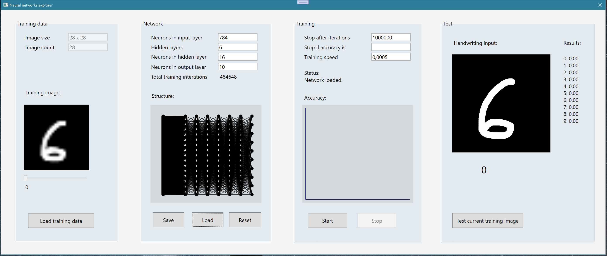

# Neural Networks explorer

## Overview
I wanted to learn more Neural Networks, so I started exploring the solutions on github.
I found a basic implementation from Leonard Rabes (https://github.com/LeonardRabes/HandwritingRecognition) 
that seemed easy enough to understand for me.
I didn't want to use a prebuild complex library, but understand the very basics, especially the
backpropagation algorithm.

While playing around with Leonards solution, I decided to improve his work and build a new WPF frontend for it.

## About Neural Networks explorer

The app contains 4 sections:
- Section 1 contains the set of training images. 
I also chose (as Leonard) the MNIST data set (https://en.wikipedia.org/wiki/MNIST_database), 
containing 60.000 classified images
You can go through the images with the slider.

- Section 2 contains parameters and a visualization of the network structure.
To change the structure, you can enter new values and click "Reset". 
All training data will be lost.
Changing the input or output layer isn't implemented.

- Section 3 ist the training section and contains two stop conditions. 
You can stop training manually at any point of time, or stop after a count or when
an accuracy is reached.
Training speed is the factor used to adjust the weights during backpropagation.
The diagram tries to visualize the overall accuracy.
You might see a drop after a long rise. This is an indicator the network has reached 
a local accuracy maximum. I didn't have the time to find out how to improve the
training algorithm in this regard.

- Section 4 is the test section where you can draw a number 
and check if it's classified correctly.

## How to use
- Build and start the program.
- Click "Load training data" (the app expects two files in the bin folder)
- Click "Start" training
- After some time, Stop the training and draw a number in section 4

## License
Licensed under Apache licence.
https://www.apache.org/licenses/LICENSE-2.0

## Compatibility
The application was build with DotNET 6.

## Source code
The source code is hosted at:
https://github.com/OliverAbraham/neuralNetworks

## Author
- Oliver Abraham
- EMail: mail@oliver-abraham.de
- Web:  https://www.oliver-abraham.de
- Linkedin: https://www.linkedin.com/in/oliver-abraham-5345941ab/

Please feel free to comment and suggest improvements!
